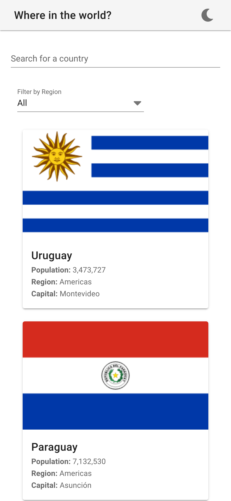
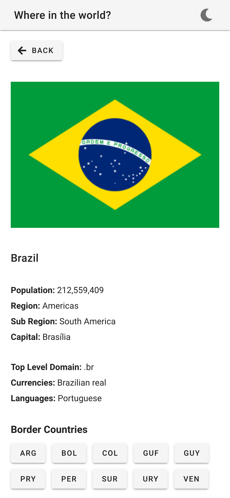

# Countries - Frontend Challenge

Adaptation of the [REST Countries API Challenge](https://www.frontendmentor.io/challenges/rest-countries-api-with-color-theme-switcher-5cacc469fec04111f7b848ca) from Frontend Mentor using Vue and Vuetify.
The style guide was ignored as my goal with this challenge was to get myself familiarized with the Vuetify UI Library.

 

  
  &nbsp;&nbsp;&nbsp;&nbsp;&nbsp;&nbsp;&nbsp;
  

---

